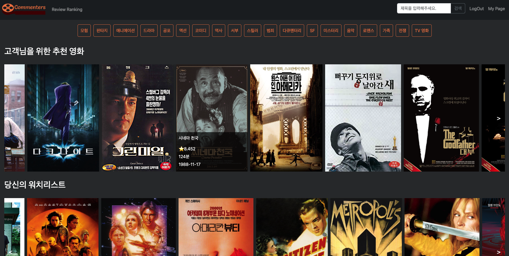
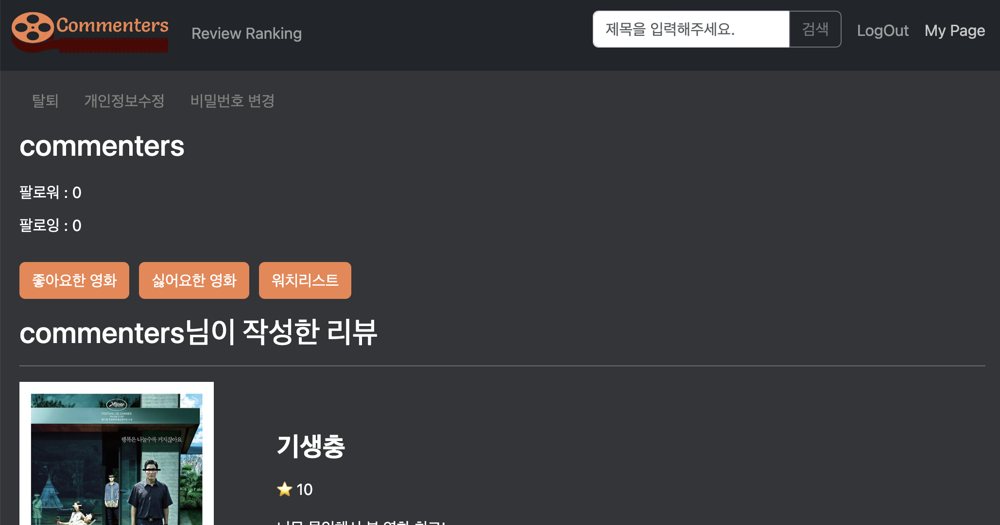
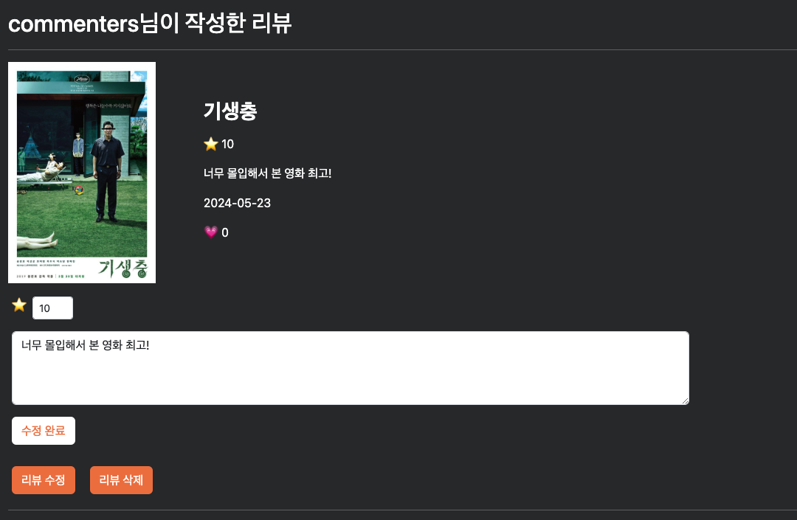
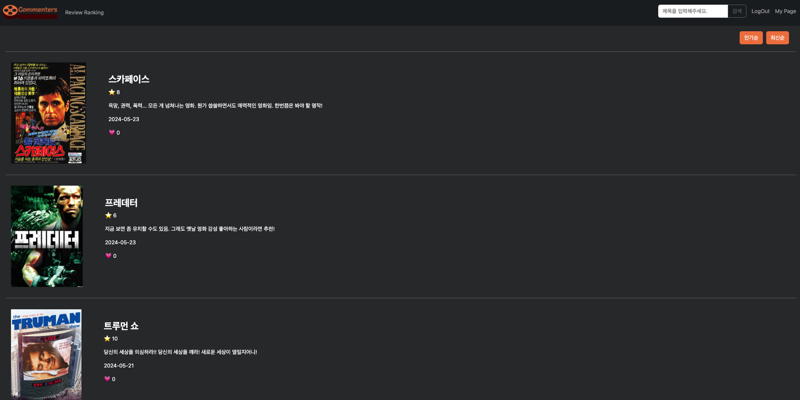
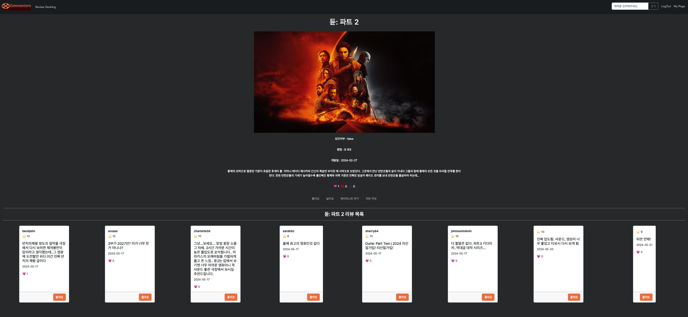
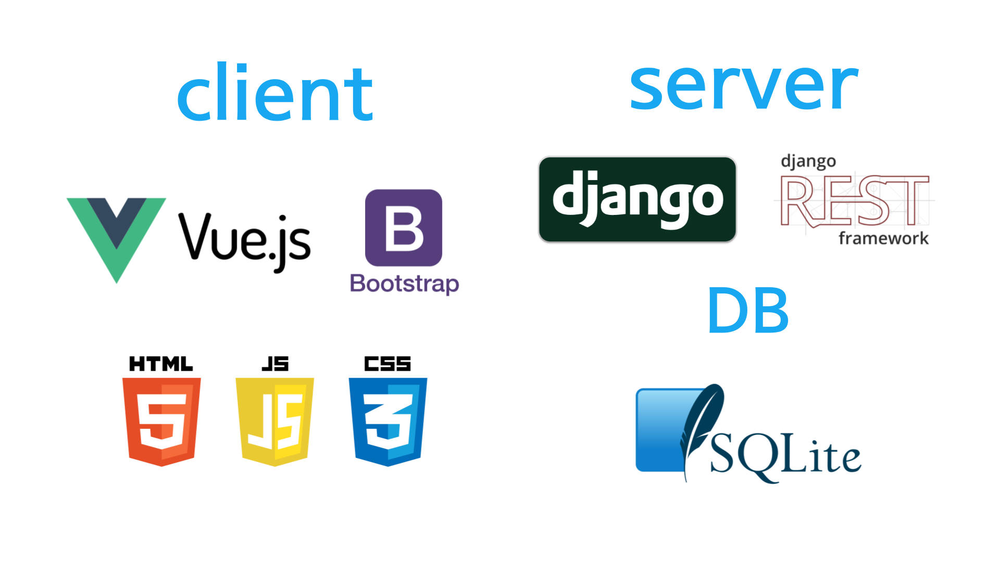
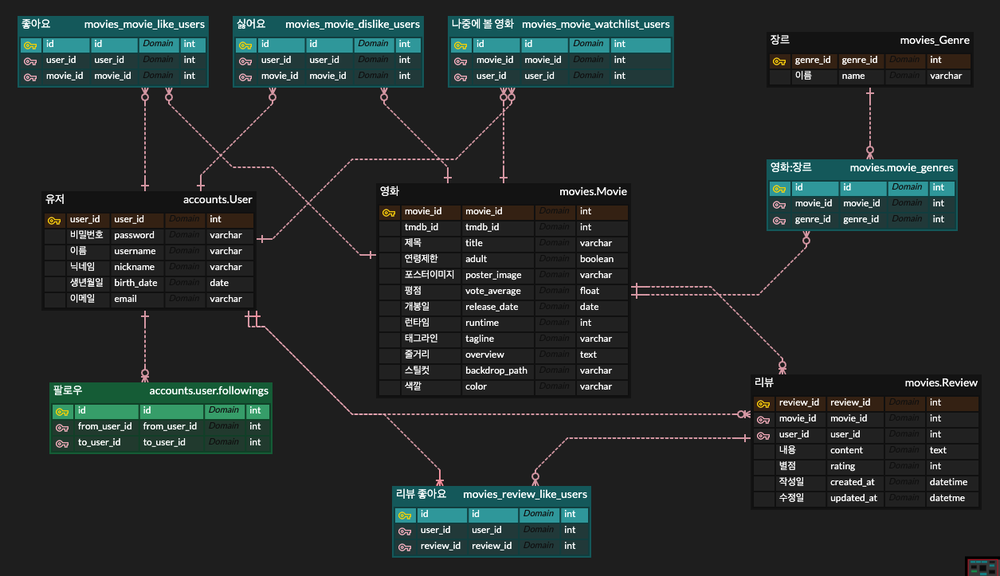
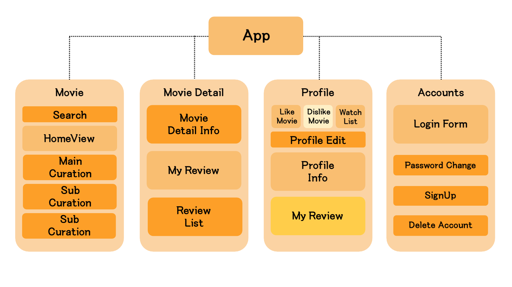
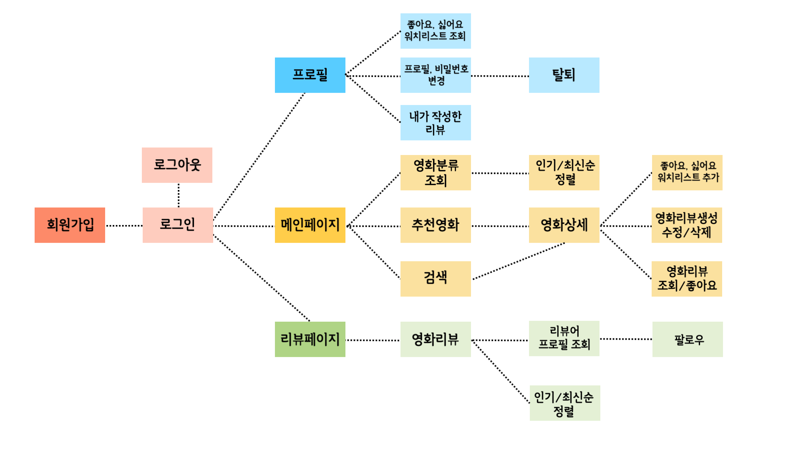

# Django와 Vue.js를 활용한 리뷰 기반 영화 추천 웹사이트

- 프로젝트 기간 : 2024.05.16 (목) ~ 2024.05.23 (목)
<br>

## 🔥 씬 스틸러스

- ### 🙎🏻‍♂️ 문재성 
    - 프론트엔드 (40%) / 백엔드 (60%) 
    - 데이터 크롤링, 백엔드 로직 구성, 시리얼라이저 구성

<br>

- ### 🙎🏻‍♀️ 이한솔
    - 프론트엔드 (60%) / 백엔드 (40%)
    - DB 모델링, 백엔드에서 받아온 데이터로 프론트엔드 구현

<br>

## 💻 구현 

### Home

#### 📍 좋아요, 싫어요, 워치리스트에 따른 영화 추천
#### 📍 검색 기능
#### 📍 장르별 영화 조회
<br>

### Profile

<br>


#### 📍 탈퇴, 수정, 비밀번호 변경
#### 📍 좋아요, 싫어요, 워치리스트 조회
#### 📍 팔로우, 팔로잉
#### 📍 작성한 리뷰 조회, 수정, 삭제
<br>

### Review Ranking

#### 📍 인기순, 최신순 리뷰 조회
<br>

### Movie Detail

#### 📍 영화 정보 조회
#### 📍 영화 리뷰 조회, 좋아요
#### 📍 리뷰를 통해 다른 유저 프로필 방문
<br>

### Genre List

#### 📍 장르별 영화 조회
#### 📍 인기순, 최신순 정렬
<br>

## 📝 기획의도

-  무수히 많은 영화들이 모여 있는 OTT를 한참을 뒤적이는, 선택에 어려움을 겪는 고객들에게 단 몇 마디로 이목을 끄는 **매력적인 리뷰**로 영화를 추천
- 매일 달라지는 **추천 색감 영화**로 흥미 제공

<br>

## 🛠️ 기술 스택


<br>

## 📊 ERD


<br>

## 🗒️ 컴포넌트 구조


<br>

## 👨‍👩‍👧‍👦 유저플로우


<br>

## 🎲 서비스 구현
| No | 기능 | 설명       | 
|----|------|------------|
| 1  | 로그인 | 로그인 기능 | 
| 2  | 로그아웃 | 로그아웃 기능 | 
| 3  | 회원가입 | 회원가입 기능 | 
| 4  | 마이페이지 | 회원 프로필 페이지 | 
| 5  | 회원탈퇴 | 회원탈퇴 기능 |
| 6  | 개인정보수정 | 개인정보수정 기능 |
| 7  | 팔로우, 언팔로우 | 팔로우, 언팔로우 수 즉각 반영 |
| 8  | 좋아요, 싫어요, <br>워치리스트 조회 | 본인 또는 다른 사용자가 <br>좋아요, 싫어요, 워치리스트에 추가한 <br>영화 목록 조회 가능 |
| 9  | 리뷰수정,삭제 | 본인이 작성한 리뷰는 <br>본인의 프로필 페이지에서 <br>조회, 수정, 삭제 가능
| 10 | 장르 분류 | 장르별로 영화 조회 가능 |
| 11 | 마우스오버효과 | 영화 포스터에 마우스를 올리면 <br>영화의 상세 정보 표시 |
| 12 | 영화 디테일 페이지 | 영화 포스터를 누르면 <br>디테일 페이지로 이동 |
| 13 | 추천 알고리즘 | 사용자의 좋아요, 싫어요, 워치리스트 <br>정보에 따른 영화 추천 |
| 14 | 색깔 영화 추천 | 매일 바뀌는 무작위 색깔의 <br>색감을 가진 영화 추천 |
| 15 | 영화 슬라이드 | 메인 페이지에서 한줄에서 <br>출력된 모든 영화를 슬라이드하며 <br>볼 수 있음 |
| 16 | 영화 정렬 | 최신순, 인기순으로 정렬 |
| 17 | 워치리스트 즉각 반영 | 워치리스트에 있는 영화에 <br>리뷰 작성시 워치리스트에서 제외 |
| 18 | 검색 | 영화를 검색하고 일부글자만 <br>포함돼도 검색됨 | 
| 19 | 리뷰랭킹 | 리뷰를 최신순, 인기순으로 정렬 | 
| 20 | 영화 리뷰 작성 | 영화에 별점과 함께 리뷰 작성 가능 |
| 21 | 리뷰 좋아요 | 사용자들이 작성한 리뷰에 좋아요 기능 |
| 22 | 본인 리뷰 먼저 출력 | 리뷰를 작성한 영화 상세 페이지에서는 <br>본인이 작성한 리뷰를 <br>먼저 보여줌 |
| 23 | 영화 상세 페이지 <br>리뷰 수정 | 영화 상세페이지에서 리뷰 수정 가능 |
| 24 | 좋아요, 싫어요, <br>워치리스트 | 영화에 좋아요, 싫어요, 워치리스트 <br>추가 가능 |
| 25 | 싫어요 필터 | 싫어요한 영화는 추천 영화에서 제외 |
| 26 | 리뷰를 통한 <br>프로필 방문 | 리뷰의 작성자를 누르면 <br>작성자의 프로필로 이동 <br>팔로우 가능 |
| 27 | 좋아요, 싫어요, <br>워치리스트 수 | 즉각적인 변화 반영 |
| 28 | 버튼 효과 | 버튼에 커서가 올라가면 <br>확인할 수 있게 효과 추가 | 

## 💭 회고

- 🙎🏻‍♂️ 문재성 
    - 웹앱을 이용할 때 당연하게만 여기던 기능들이 실제 구현하려면
어떤 절차를 거쳐야 하는지 몰랐기 때문에 시행착오가 많이 생겼고, 백 / 프론트를 서로 나눠 진행하려고 했으나 여러 문제가 생겨 결국 기능별로 담당하게 되었다. 
프로젝트 끝에 와서는 왜 프론트와 백이 나눠지고 또 기능별로 확실하게 나눠야 하는지, 그리고 프론트와 백 간 의사소통의 중요성에 대해서도 실감하게 되었다. 
지금까지 배웠던 Django와 Vue의 구조와 사용에 대해서 조금은 이해도가 높아진 것 같고, 크롤링이나 AI 등의 기술을 실제로 사용해보면서 힘들지만 즐기면서 했던 첫 프로젝트였다!

- 🙎🏻‍♀️ 이한솔 
    - 이번 프로젝트를 통해서 API 를 잘 사용하는 방법을 확실히 익힌 것 같다. 그리고 데이터들이 어떻게 어떤 방식으로 전달되고, 또 어떻게 사용자에게 보여지는지에 대한 흐름과 로직도 완벽하게 공부할 수 있었다. 
프로젝트를 진행하는 과정에서 처음에 고려하지 못했던 기능들이 매일같이 계속 생겨났다. 처음부터 조금 더 깊게, 사용자의 입장에서 심사숙고 했었다면 프로젝트의 일정을 구체적으로 잡는데 도움이 됐었을 것 같은데 이 부분은 다소 아쉬웠다.
프론트와 백을 나누려고 했었으나 초반에는 뷰와 장고의 관계에 대한 미숙한 이해도 때문에 기능이 제대로 구현되지 않아서 한 기능을 한 사람이 맡아서 구현하는 방식으로 진행했다.
그 덕분에 위에 언급한 것 처럼 흐름과 로직에 대한 이해가 생길 수 있었다. 
하루의 마지막에는 내일 해야할 것들에 대해 논의하고 아침에는 귀가 후 각자 구현한 기능들과 당일에 해야할 일들에 대해 논의하는 등 의사소통이 굉장히 원활했던 것 같고, 그 덕분에 각자 발견하지 못했던 미흡한 부분에 대한 보완이 빠르게 이루어졌던 것 같다.
API에 대한 이해도가 부족해서 겁을 먹었던 초반과 비교해보면 불과 일주일이라는 시간안에 급속도로 성장할 수 있었던 프로젝트였다. 

## 프로젝트 실행 순서

- .env 파일 생성 (api key 작성)
- 가상 환경 생성 (python 3.9.13 version)
- 가상 환경 활성화
    - 
    ```python
    source venv_name/bin/activate
    ```
- migrate 
- load data
- django runserver
- vue 
    - 
    ```bash
    npm i
    ```
    ```bash
    npm run dev    
    ```


